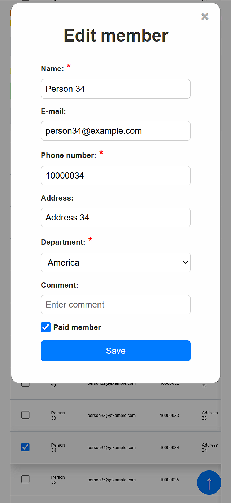

# Member Management Application

This is a Flask-based web application for managing members of an organization. The application is responsive and allows users to add, edit, delete, and filter members, as well as import and export member data using Excel files. It also includes user authentication and role-based access control.

I built this app for someone who wanted a simple web application where they could have an overview of their member information and track payment statuses aswell as import/export excel files. I took on this project because it was a great learning opportunity for me.


## Technologies and languages used:

- **Languages**: Python, JavaScript, HTML, CSS
- **Frameworks**: Flask
- **Libraries**:
  - Flask-JWT-Extended
  - pandas
  - openpyxl
  - mysql-connector-python
  - bcrypt
  - python-dotenv
- **Database**: MySQL
- **Frontend**: HTML, CSS, JavaScript

## Table of Contents

- Features
- Installation
- Configuration
- Usage
- API Endpoints
- Excel File Format
- Screenshots

## Features

- User authentication with JWT
- Role-based access control (Admin, Editor, Guest)
- Add, edit, delete, and filter members
- Import and export member data using Excel files
- User management dashboard for admins
- Responsive design

## Installation

1. Clone the repository:

```sh
git clone https://github.com/aayanaqdas/member_management_app.git
cd member_management_app
```

2. Create a virtual environment and activate it:

```sh
python -m venv venv
source venv/bin/activate  # On Windows, use `venv\Scripts\activate`
```

3. Install the required dependencies:

```sh
pip install -r requirements.txt
```

4. Set up the database:

```sh
mysql -u root -p < setup_db.sql
```

## Configuration

1. Create a `.env` file in the root directory of the project and add the following environment variables:

```env
Db_host = 'db_host_ip'
DB_user = 'db_user'
DB_password = 'db_password'
DB_name = 'memberlist'

SECRET_KEY = 'your_secret_key'
JWT_SECRET_KEY = 'your_jwt_secret_key'
```

2. Update the `sys.path.insert` line in `wsgi.py` to point to the correct project directory.

## Usage

1. Run the application:

```sh
python run.py
```

2. Open your web browser and navigate to `http://localhost:5000`.

## API Endpoints

### Authentication

- `POST /api/login`: User login
- `POST /api/logout`: User logout
- `GET /api/check_token`: Check if the token is valid

### User Management

- `POST /api/dashboard/register`: Register a new user (Admin only)
- `GET /api/dashboard/users`: Get all users (Admin only)
- `PUT /api/dashboard/users/change_role`: Change user role (Admin only)
- `DELETE /api/dashboard/users/delete`: Delete a user (Admin only)

### Member Management

- `GET /api/members`: Get all members
- `POST /api/add_member`: Add a new member
- `DELETE /api/delete_members`: Delete members
- `POST /api/filter_table`: Filter members
- `POST /api/member_info`: Get member info
- `PUT /api/update_member_info`: Update member info

### Excel Import/Export

- `POST /api/import_members`: Import members from an Excel file
- `GET /api/export_members`: Export members to an Excel file

## Excel File Format

Ensure members from different departments are in different files and import them seperately.
To import members using an Excel file, ensure that your file follows the format below:

| Column Name | Description                |
|-------------|----------------------------|
| `name`      | Full name of the member    |
| `email`     | Email address of the member|
| `address`   | Address of the member      |
| `number`    | Phone number of the member |
| `paid`      | Payment status (Yes/No)    |

Example:

| name       | email             | address         | number       | paid |
|------------|-------------------|-----------------|--------------|------|
| John Doe   | john@example.com  | 123 Main St     | 12345678     | Yes  |
| Jane Smith | jane@example.com  | 456 Elm St      | 87654321     | No   |

## Screenshots

### Login Page
<a href="static/images/readMe/login.png" target="_blank">
  
</a>

### Member List
<a href="static/images/readMe/memberlist.png" target="_blank">
  
</a>

### Filter Members
<a href="static/images/readMe/filters.png" target="_blank">
  
</a>

### Memberlist and Filters Mobile
<div style="display: flex; gap:8px;">
  <a href="static/images/readMe/mobileMemberlist.png" target="_blank">
    
  </a>
  <a href="static/images/readMe/mobileFilter.png" target="_blank">
    
  </a>
</div>

### Add Member Form
<a href="static/images/readMe/addMemberModal.png" target="_blank">
  
</a>

### Edit Member Form
<a href="static/images/readMe/editMemberModal.png" target="_blank">
  
</a>

### Edit Member Form Mobile
<a href="static/images/readMe/mobileEditMember.png" target="_blank">
  
</a>

### Import Members Form
<a href="static/images/readMe/importModal.png" target="_blank">
  
</a>

### Excel Export File
<a href="static/images/readMe/export.png" target="_blank">
  
</a>

### Admin Panel
<a href="static/images/readMe/dashboard.png" target="_blank">
  
</a>

### Register User Form
<a href="static/images/readMe/registerUser.png" target="_blank">
  
</a>

